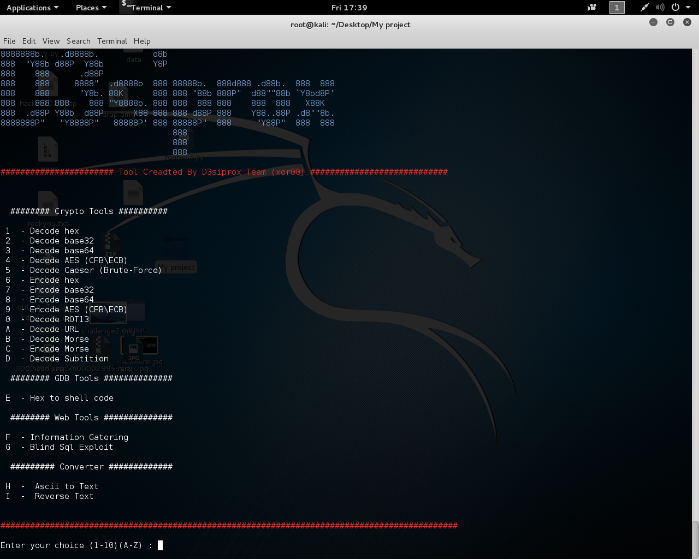

#New Tool Created By D3siprox Team  (xor00)

This Tool is Developed To Help and To minimize the Time and facilitate challenges .

 Crypto : 

To Encrypt / Decrypt  :

- Decode hex
- Decode base32
- Decode base64
- Decode AES (CFB\ECB)
- Decode Caeser (Brute-Force)
- Encode hex
- Encode base32
- Encode base64
- Encode AES (CFB\ECB)
- Decode ROT13
- Decode URL
- Decode Morse
- Encode Morse
- Decode Subtition

 Web : 

To Get information about Your Target & Exploit

- Information Gatering
- Blind Sql Exploit

Usage : 

Attached File : http://www.mediafire.com/download/x3vqzxcmwzg7xwv/dic.zip

Unzip Add this file to Python Tool Directory 

roo@root$: ./csolve.py

